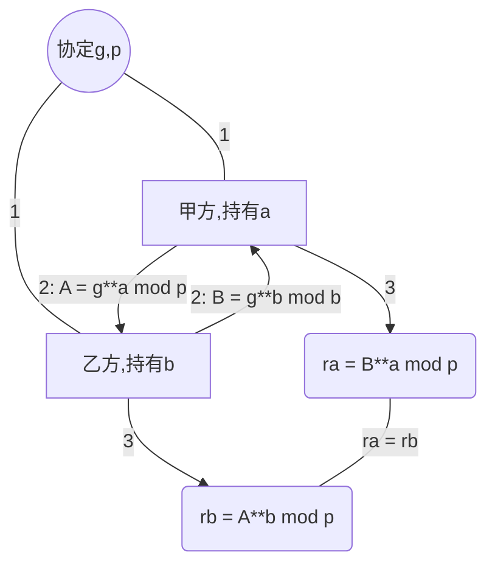

# Preface

调查golang服务端选型的时候发现了这个密钥算法。

> **迪菲-赫尔曼密钥交换**（英语：Diffie–Hellman key exchange，缩写为D-H） 是一种[安全协议](https://zh.wikipedia.org/wiki/安全协议)。它可以让双方在完全没有对方任何预先信息的条件下通过不安全[信道](https://zh.wikipedia.org/wiki/信道)创建起一个[密钥](https://zh.wikipedia.org/wiki/密钥)。这个密钥可以在后续的通讯中作为[对称密钥](https://zh.wikipedia.org/wiki/对称密钥)来[加密](https://zh.wikipedia.org/wiki/加密)通讯内容。公钥交换的概念最早由[瑞夫·墨克](https://zh.wikipedia.org/wiki/瑞夫·墨克)（Ralph C. Merkle）提出，而这个密钥交换方法，由[惠特菲尔德·迪菲](https://zh.wikipedia.org/wiki/惠特菲爾德·迪菲)（Bailey Whitfield Diffie）和[马丁·赫尔曼](https://zh.wikipedia.org/wiki/馬丁·赫爾曼)（Martin Edward Hellman）在1976年首次发表。马丁·赫尔曼曾主张这个密钥交换方法，应被称为**迪菲-赫尔曼-墨克密钥交换**（英语：Diffie–Hellman–Merkle key exchange）

# Contents

原理其实很简单：

* 双方协定一个质数 p以及g
* 然后各自选择一个喜欢的数作为自己的秘密整数a
* 然后向对方发送己方的 g**a mod p = C
* 在收到对方的C之后，计算C**a mod p，双方的这个值是相等的

# Reference

[迪菲-赫爾曼密鑰交換](https://zh.wikipedia.org/wiki/迪菲-赫爾曼密鑰交換)