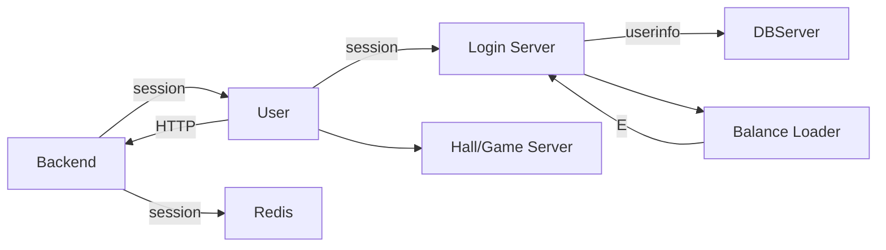

### Attention
> Don't over packed.

### Comments
可能目前没有能力去编写一个服务端框架，现在应该主要以熟练使用和了解一个游戏服务器框架为主。
参考框架： cellnet, leaf

### Server Impl Details

###  mongo

[mgo](<https://cloud.tencent.com/developer/article/1381764>)

### Redis vs ssdb

### Login Precedure

* 玩家http登陆
* 登陆成功session写入redis，设置超时时间与超时机制
* 玩家以session连接socket
* 连接成功返回用户信息
* 登陆成功

### Session

1. 测试连后台api生成session
2. 后台生成测试账号和session并插入redis
3. 玩家使用此session进行登陆

### Zookeeper VS Consul
Refer:
[基于consul构建golang系统分布式服务发现机制](http://www.bugclosed.com/post/5)

### Hotupdate

[golang程序配置文件热更新](http://www.bugclosed.com/post/4)

### Log

* 控制台输出日志
* 日志文件

### Heartbeat

### RocketMQ

### 通讯格式

Thrift VS Protobuf

### 运维工具

[Grafana](https://www.cnblogs.com/imyalost/p/9873641.html)

[gochart](https://github.com/fananchong/gochart)

### Docker Swarm

### EventLoop

### Global Timer

### Protobuf的使用

参考:
* [Golang Protobuf Github](https://github.com/golang/protobuf)
* [Protobuffer on Github](
https://github.com/protocolbuffers/protobuf)
* gogoprotobuf

### 其他参考

* [Go游戏服务器开发的一些思考](https://blog.csdn.net/u013272009/article/details/73001638)

